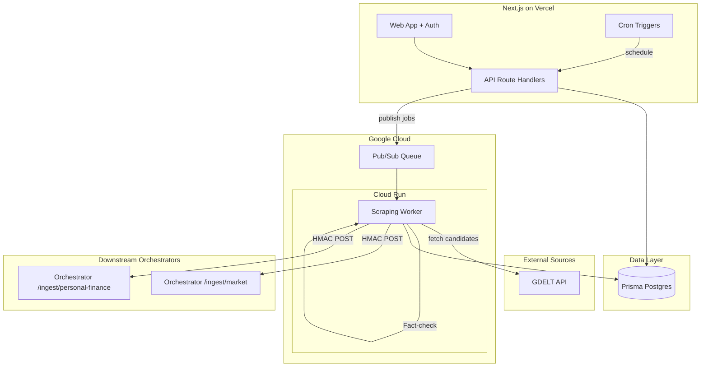

# AI-Assisted Multi-Theme News Scraping Platform – Planning Document

## Explicit Assumptions

1. **GDELT Integration**: GDELT is the **sole source** of scraping URLs. GDELT 2.0 API/GKG provides candidate URLs + metadata; no other feeds supply URLs for extraction.
2. **Orchestrator**: External system; we only POST `news_item` JSON to configured URLs. No orchestrator implementation in this project.
3. **Prisma Postgres**: Using Prisma Data Platform (Prisma.io Postgres) as specified; schema optimized for Prisma client.
4. **Vertex AI**: Available in same GCP project as Cloud Run workers; Gemini 1.5 Flash/Pro for different tasks.
5. **NextAuth**: NextAuth.js v5 (Auth.js) with credentials or OAuth providers.
6. **Playwright**: Headless browser in Cloud Run; Puppeteer/Playwright container image for JS-heavy fallback.
7. **Frontend**: shadcn/ui for all UI components (Button, Card, Table, Tabs, Form, Dialog, Badge, etc.).

---

## A) System Architecture Diagram




**Component Roles**


| Component            | Role                                                                                                                                                 |
| -------------------- | ---------------------------------------------------------------------------------------------------------------------------------------------------- |
| **Next.js (Vercel)** | Auth, Theme CRUD, config UI, manual triggers, API for scheduling                                                                                     |
| **Cloud Run Worker** | Fetch GDELT, scrape, extract (Trafilatura→Readability→Playwright), extract claims, fact-check claims, produce `news_item`, deliver to Theme endpoint |
| **Pub/Sub**          | Job queue (ingestion/scrape jobs); decouples Vercel from long-running scraping                                                                       |
| **Prisma Postgres**  | All persistence: users, themes, configs, jobs, extractions, claims, delivery logs, budgets, tuning                                                   |
| **Orchestrator**     | External; receives per-Theme POST with HMAC-signed `news_item`                                                                                       |


**Data Flow (per Theme)**

1. **Schedule**: Cron or manual trigger → query GDELT for candidate URLs (filtered by theme/subtopic/language/region) → create `IngestionJob` → publish scrape tasks to Pub/Sub (respecting daily/hourly budget).
2. **Worker**: Consume task (URL from GDELT payload) → scrape URL → extract clean_text (Trafilatura→Readability→Playwright) → LLM produces summary.editorial from clean_text → extract claims (LLM) → fact-check each claim (LLM, required) → build `news_item` → quality gate → dedup → POST to Theme endpoint.
3. **Post-delivery**: Log to `DeliveryLog`; update `DailyBudgetUsage`; optionally feed into daily tuning.

**Summary production**: AI generates `summary.editorial` from the **extracted article content** (clean_text), not from the URL. GDELT supplies the URL; scraping yields clean_text; LLM summarizes that content for the payload.

---

## B) Database Schema Proposal (Prisma)

```prisma
// ============ AUTH & USERS ============
model User {
  id            String    @id @default(cuid())
  email         String    @unique
  name          String?
  image         String?
  emailVerified DateTime?
  createdAt     DateTime  @default(now())
  updatedAt     DateTime  @updatedAt
  accounts      Account[]
  sessions      Session[]
}

model Account {
  id                String  @id @default(cuid())
  userId            String
  type              String
  provider          String
  providerAccountId String
  refresh_token     String?
  access_token      String?
  expires_at        Int?
  user              User    @relation(fields: [userId], references: [id], onDelete: Cascade)
}

model Session {
  id           String   @id @default(cuid())
  userId       String
  sessionToken String   @unique
  expires      DateTime
  user         User     @relation(fields: [userId], references: [id], onDelete: Cascade)
}

// ============ THEMES & CONFIG ============
model Theme {
  id          String   @id @default(cuid())
  name        String   // e.g., "Market News"
  slug        String   @unique // e.g., "market", "personal-finance"
  description String?
  createdAt   DateTime @default(now())
  updatedAt   DateTime @updatedAt
  subtopics   Subtopic[]
  configs     ThemeConfig[]
  delivery    ThemeDeliveryEndpoint?
  domainRules DomainRule[]
  ingestionJobs   IngestionJob[]
  extractedDocs  ExtractedDocument[]
  newsItems      NewsItem[]
  deliveryLogs   DeliveryLog[]
  budgetUsage    DailyBudgetUsage[]
  tuningRuns     DailyTuningRun[]
}

model Subtopic {
  id          String  @id @default(cuid())
  themeId     String
  name        String  // e.g., "rates", "earnings"
  slug        String
  weight      Float   @default(1.0) // for ranking/diversification
  theme       Theme   @relation(fields: [themeId], references: [id], onDelete: Cascade)
  @@unique([themeId, slug])
}

model ThemeConfig {
  id                    String   @id @default(cuid())
  themeId               String
  version               Int      // incremental
  targetLanguages       String[] // ["en", "es"]
  targetRegions         String[] // ["US", "EU"]
  minTextLengthThreshold Int     @default(500)
  minQualityScore       Float    @default(0.6)
  qualityFlagsHandling  Json?    // {"paywall": "drop", "low_title": "hold"}
  maxRefutedClaimsBeforeHold Int? // hold delivery if >N claims refuted; null = no hold
  scheduleCron          String?  // e.g., "0 */6 * * *" (every 6h)
  dailyExtractionBudget Int     @default(500)
  hourlyRateLimit      Int?     // null = no hourly cap
  gdeltQueryParams     Json?    // theme/subtopic/language/region filters
  createdAt             DateTime @default(now())
  createdBy             String?  // userId or "system"
  changeReason          String?
  theme                 Theme    @relation(fields: [themeId], references: [id], onDelete: Cascade)
  changeLogs            ConfigChangeLog[]
}

model ConfigChangeLog {
  id          String   @id @default(cuid())
  configId    String
  diff        Json     // before/after or patch
  reason      String
  author      String   // userId or "AI:DailyTuningRun:{runId}"
  createdAt   DateTime @default(now())
  config      ThemeConfig @relation(fields: [configId], references: [id], onDelete: Cascade)
}

model ThemeDeliveryEndpoint {
  id            String   @id @default(cuid())
  themeId       String   @unique
  url           String   // e.g., https://orchestrator.example.com/ingest/market
  secretHash    String   // argon2/bcrypt hash; never store raw secret
  hmacAlg       String   @default("sha256")
  createdAt     DateTime @default(now())
  updatedAt     DateTime @updatedAt
  theme         Theme    @relation(fields: [themeId], references: [id], onDelete: Cascade)
}

model DomainRule {
  id        String   @id @default(cuid())
  themeId   String
  domain    String   // e.g., "reuters.com"
  rule      String   // "allow" | "deny"
  theme     Theme    @relation(fields: [themeId], references: [id], onDelete: Cascade)
  @@unique([themeId, domain])
}

// ============ JOBS & EXTRACTION ============
model IngestionJob {
  id          String   @id @default(cuid())
  themeId     String
  status      String   // "pending" | "running" | "completed" | "failed"
  triggerType String   // "cron" | "manual"
  configVersion Int?
  createdAt   DateTime @default(now())
  completedAt DateTime?
  theme       Theme    @relation(fields: [themeId], references: [id], onDelete: Cascade)
  scrapeJobs  ScrapeJob[]
}

model ScrapeJob {
  id             String   @id @default(cuid())
  ingestionJobId String
  url            String
  canonicalUrl   String?
  status         String   // "pending" | "scraping" | "extracted" | "failed" | "skipped"
  createdAt      DateTime @default(now())
  completedAt    DateTime?
  ingestionJob   IngestionJob @relation(fields: [ingestionJobId], references: [id], onDelete: Cascade)
  attempts       ExtractionAttempt[]
  extractedDoc   ExtractedDocument?
}

model ExtractionAttempt {
  id          String   @id @default(cuid())
  scrapeJobId String
  method      String   // "trafilatura" | "readability" | "playwright"
  status      String   // "success" | "failed"
  durationMs  Int?
  cleanTextLength Int?
  errorMsg    String?
  createdAt   DateTime @default(now())
  scrapeJob   ScrapeJob @relation(fields: [scrapeJobId], references: [id], onDelete: Cascade)
}

model ExtractedDocument {
  id              String   @id @default(cuid())
  scrapeJobId     String   @unique
  themeId         String
  rawHtml         String?  @db.Text // optional; omit in prod for storage
  cleanText       String   @db.Text
  headline        String?
  canonicalUrl    String?
  sourceDomain    String?
  publishedAt     DateTime?
  scrapedAt       DateTime @default(now())
  language        String?
  extractionMethod String  // trafilatura | readability | playwright
  textLength      Int
  qualityScore    Float?
  qualityFlags    Json?    // ["paywall_suspect", "low_title", ...]
  dedupHash       String   // content hash for dedup
  createdAt       DateTime @default(now())
  scrapeJob       ScrapeJob @relation(fields: [scrapeJobId], references: [id], onDelete: Cascade)
  theme           Theme    @relation(fields: [themeId], references: [id], onDelete: Cascade)
  newsItem        NewsItem?
}

model NewsItem {
  id          String   @id @default(cuid())
  extractedDocId String @unique
  themeId     String
  payload     Json     // full news_item JSON including claims[] with fact-check (verdict, confidence, sources)
  summaryEditorial String? @db.Text
  summaryExtraction Json?  // method, duration, flags
  entities    Json?    // companies, people, countries, tickers
  topics      Json?    // topic/subtopic tags
  deliveredAt DateTime?
  deliveryStatus String?  // "sent" | "failed" | "held"
  createdAt   DateTime @default(now())
  extractedDoc ExtractedDocument @relation(fields: [extractedDocId], references: [id], onDelete: Cascade)
  theme       Theme    @relation(fields: [themeId], references: [id], onDelete: Cascade)
  claims      Claim[]
}

model Claim {
  id             String   @id @default(cuid())
  newsItemId     String
  text           String   @db.Text
  verified       Boolean  @default(false) // has evidence
  paragraphIndex Int?
  charStart      Int?
  charEnd        Int?
  factCheckVerdict   String?  // "supported" | "refuted" | "unverifiable" | "mixed"
  factCheckConfidence Float?  // 0–1
  factCheckSources   Json?   // [{url, snippet, verdict}]
  factCheckedAt      DateTime?
  createdAt      DateTime @default(now())
  newsItem       NewsItem @relation(fields: [newsItemId], references: [id], onDelete: Cascade)
  evidences      Evidence[]
}

model Evidence {
  id        String   @id @default(cuid())
  claimId   String
  type      String   // "paragraph" | "char_span"
  ref       String   // e.g., "p:2" or "0:120-340"
  content   String?  @db.Text
  claim     Claim    @relation(fields: [claimId], references: [id], onDelete: Cascade)
}

model DeliveryLog {
  id          String   @id @default(cuid())
  themeId     String
  newsItemId  String?
  endpointUrl String
  statusCode  Int?
  requestId   String?
  errorMsg    String?
  attemptedAt DateTime @default(now())
  theme       Theme    @relation(fields: [themeId], references: [id], onDelete: Cascade)
}

model DailyBudgetUsage {
  id        String   @id @default(cuid())
  themeId   String
  date      DateTime @db.Date
  used      Int      @default(0)
  limit     Int
  theme     Theme    @relation(fields: [themeId], references: [id], onDelete: Cascade)
  @@unique([themeId, date])
}

model DailyTuningRun {
  id              String   @id @default(cuid())
  themeId         String
  ranAt           DateTime @default(now())
  recommendations Json     // list of suggested config changes
  appliedChanges  Json?    // what was applied (ref to ConfigChangeLog ids)
  theme           Theme    @relation(fields: [themeId], references: [id], onDelete: Cascade)
}
```

**Schema Notes**

- `ThemeDeliveryEndpoint.secretHash`: Store only hash; raw secret shown once on create (or via secure rotate flow).
- `ExtractedDocument.rawHtml`: Optional; omit or use separate object storage if too large.
- Indexes: Add on `themeId`, `scrapedAt`, `status`, `dedupHash`, `canonicalUrl` for filters and dedup lookups.

---

## C) API Design

**Next.js App Router routes** (all under `/api`; auth middleware on protected routes)


| Method | Route                                  | Purpose                                         |
| ------ | -------------------------------------- | ----------------------------------------------- |
| POST   | `/api/themes`                          | Create theme                                    |
| GET    | `/api/themes`                          | List themes                                     |
| GET    | `/api/themes/[slug]`                   | Get theme + current config                      |
| PATCH  | `/api/themes/[slug]`                   | Update theme metadata                           |
| POST   | `/api/themes/[slug]/config`            | Create new config version                       |
| GET    | `/api/themes/[slug]/config`            | Get current config                              |
| POST   | `/api/themes/[slug]/config/validate`   | Validate config (no save)                       |
| GET    | `/api/themes/[slug]/delivery`          | Get delivery endpoint metadata (no secret)      |
| PUT    | `/api/themes/[slug]/delivery`          | Set/rotate delivery URL + secret                |
| POST   | `/api/themes/[slug]/ingestion/trigger` | Manual ingestion trigger                        |
| GET    | `/api/themes/[slug]/extractions`       | List extractions (table) with filters           |
| GET    | `/api/themes/[slug]/extractions/[id]`  | Extraction detail (full JSON + logs)            |
| GET    | `/api/themes/[slug]/budget`            | Daily usage vs budget                           |
| GET    | `/api/themes/[slug]/dashboard`         | Monitoring: success rates, failures, duplicates |


**Worker Service** (Cloud Run, internal only)


| Method | Route             | Purpose                                                                          |
| ------ | ----------------- | -------------------------------------------------------------------------------- |
| POST   | `/worker/scrape`  | Consume scrape task; receive URL + themeId; perform extraction; enqueue delivery |
| POST   | `/worker/deliver` | Deliver `news_item` to Theme endpoint (or separate step in same worker)          |


**Pub/Sub**

- Topic: `scrape-jobs`
- Message: `{ ingestionJobId, scrapeJobId, url, themeId, configVersion }`
- Worker subscribes; processes one message at a time per worker instance (or controlled concurrency).

---

## D) Job Orchestration Plan

**Where Workers Run**

- **Cloud Run** service, triggered by Pub/Sub push subscription or pull.
- Container: Node.js + Trafilatura (Python via subprocess or use `trafilatura` npm port) + Readability-lxml (python) or `mozilla-readability` (JS) + Playwright.
- Alternative: Use Python worker (Trafilatura, Readability native) and call from Node; or pure Node with `@mozilla/readability`, `trafilatura` JS port, and Playwright.

**Queue**

- **Primary**: Google Pub/Sub. Vercel cron or API publishes messages.
- **Fallback**: DB-backed queue: `ScrapeJob` with `status=pending`; worker polls or uses Supabase Realtime / DB LISTEN.

**Budget Enforcement**

1. Before publishing scrape tasks: Query `DailyBudgetUsage` for theme + date; if `used >= limit`, stop publishing for that theme for the day.
2. Optional hourly: Sliding window counter or `hourly_budget_usage` table; check before each publish.
3. Atomic increment: `UPDATE DailyBudgetUsage SET used = used + 1 WHERE themeId = ? AND date = ? AND used < limit RETURNING *`; if no row, skip.

**Dedup Strategy**

- **Canonical URL**: Normalize (strip fragments, trailing slash, etc.); check `ExtractedDocument` or `ScrapeJob` for `canonicalUrl` before full scrape.
- **Content hash**: After extraction, compute SHA-256 of normalized `cleanText`; if exists for theme+date window, reject as duplicate.

**Retries & Timeouts**

- Trafilatura: 15s timeout; on failure → Readability.
- Readability: 15s timeout; on failure → Playwright.
- Playwright: 45s timeout; on failure → mark job failed, log error.
- Delivery: 3 retries with exponential backoff (1s, 2s, 4s); timeout 30s per attempt.

---

## E) Model Strategy


| Task                         | LLM vs Deterministic | Model            | Notes                                                               |
| ---------------------------- | -------------------- | ---------------- | ------------------------------------------------------------------- |
| Config assistant             | LLM                  | Gemini 1.5 Flash | Objectives-first: user describes goals → AI fills all config fields |
| Topic classification         | LLM                  | Gemini 1.5 Flash | Classify article into theme subtopics; batch for cost               |
| Claim extraction             | LLM                  | Gemini 1.5 Pro   | Extract atomic claims + evidence spans; strict schema               |
| Fact-check                   | LLM                  | Gemini 1.5 Pro   | Required; per-claim verdict, confidence, sources                    |
| Daily tuning                 | LLM                  | Gemini 1.5 Flash | Analyze metrics → suggest config changes                            |
| Quality gate (deterministic) | Code                 | -                | Length, language, boilerplate, paywall markers, title quality       |
| Dedup                        | Code                 | -                | Hash comparison                                                     |
| HMAC signing                 | Code                 | -                | No LLM                                                              |


**Claim-Evidence Guardrails**

- Output schema: `claims[].evidence` required; if absent, set `verified: false`.
- Post-process: Claims without `evidence` or invalid spans → mark `unverified`; do not treat as hard facts.
- Fact-check (required): Every claim receives `verdict`, `confidence`, optional `sources`. Claims without evidence → fact-check returns `unverifiable`.
- Quality gate: Items with >N refuted claims may be held; configurable per theme via `maxRefutedClaimsBeforeHold`.

**Vertex AI Models**

- `gemini-1.5-flash` (or `gemini-1.5-flash-002`): Config assistant, classification, daily tuning.
- `gemini-1.5-pro` (or `gemini-1.5-pro-002`): Claim extraction, fact-check.
- OpenAI via Vertex: Use if needed for compatibility; Vertex supports OpenAI-compatible endpoints.

**Fact-Check Integration (Required)**

- Runs after claim extraction for every extracted claim.
- Output: `verdict` (supported / refuted / unverifiable / mixed), `confidence` (0–1), optional `sources` (URLs/snippets).
- Claims without evidence: marked `unverifiable`; never delivered as hard facts.
- Quality gate: Items with >N refuted claims may be held or flagged before delivery.

---

## F) Security & Compliance

**Auth**

- NextAuth.js v5 with Credentials or OAuth (Google, GitHub).
- Session in JWT or DB; protect all `/api/themes/*` routes.

**Delivery Security**

- HMAC-SHA256: `signature = HMAC(secret, timestamp + "|" + body)`.
- Headers: `X-Timestamp`, `X-Signature`.
- Orchestrator must reject if timestamp outside ±5 min window (replay protection).

**Rate Limiting**

- Vercel: Upstash Redis or Vercel KV for rate limits on `/api/*`.
- Per-user: 100 req/min for API; per-IP for public auth endpoints.

**Audit**

- `ConfigChangeLog`: Every config change with diff, reason, author.
- `DeliveryLog`: All delivery attempts with status, timestamps.
- Do not log raw request/response bodies in production; log IDs and status only.

**Compliance**

- Store for analysis/claim extraction only; do not republish verbatim.
- Include `source_domain`, `url`, `published_at` in `news_item` for referencing.
- Terms of use and robots.txt respected; reasonable crawl delay if needed.

---

## G) MVP (2 Weeks) vs V1 (6 Weeks)

**MVP (2 Weeks)**

- Next.js App Router scaffold + NextAuth (credentials or Google)
- Prisma schema: User, Theme, ThemeConfig (single version), ThemeDeliveryEndpoint, DomainRule, IngestionJob, ScrapeJob, ExtractedDocument, NewsItem
- shadcn/ui setup; Theme CRUD + basic config form (languages, regions, budget, schedule)
- Delivery endpoint config (URL + secret)
- Manual ingestion trigger → publish to Pub/Sub (or in-process queue)
- Cloud Run worker: GDELT mock or hardcoded URLs → Trafilatura→Readability→Playwright extraction
- `news_item` JSON generation (basic: url, headline, clean_text, summary.editorial, summary.extraction)
- HMAC delivery to Theme endpoint
- Extractions table (list) + detail view (full JSON)
- Daily budget enforcement (check before scrape)
- Dedup by canonical URL + content hash

**V1 (6 Weeks) – post-MVP**

- Full GDELT integration (real query params)
- Subtopic taxonomy + weights
- Claim extraction + Evidence (LLM)
- Fact-check (LLM, required): verdict, confidence, sources per claim
- Quality gate (deterministic + semantic classification; includes refuted-claims hold)
- Config versioning + ConfigChangeLog + audit UI
- Cron scheduling (Vercel Cron or external)
- Hourly rate limit
- Daily tuning run (LLM analysis → recommendations)
- AI Config Assistant: objectives-first (user describes goals → AI fills config fields)
- Monitoring dashboard (success rates, failures, duplicates, costs)
- Model selection per task in Theme config

---

## H) Prioritized Backlog with Tickets


| Id   | Title                         | Priority | Acceptance Criteria                                                           |
| ---- | ----------------------------- | -------- | ----------------------------------------------------------------------------- |
| T1   | Next.js + Auth setup          | P0       | App Router, shadcn/ui, NextAuth with one provider, protected layout           |
| T2   | Prisma schema + migrations    | P0       | All models from section B; migrate to Prisma Postgres                         |
| T3   | Theme CRUD API                | P0       | Create, read, update themes; slug unique                                      |
| T4   | Theme config API              | P0       | Create config version; validate; link to theme                                |
| T5   | Delivery endpoint API         | P0       | Set URL + secret; store hash only; rotate flow                                |
| T6   | Extractions list API          | P0       | Filter by date, status, domain, subtopic, method, quality                     |
| T7   | Extractions detail API        | P0       | Return full news_item JSON + attempts + delivery log                          |
| T8   | Manual ingestion trigger      | P0       | Create IngestionJob; publish scrape tasks to Pub/Sub                          |
| T9   | Cloud Run worker – extraction | P0       | Trafilatura→Readability→Playwright; produce ExtractedDocument                 |
| T10  | news_item generation          | P0       | Build JSON with required fields; store in NewsItem                            |
| T11  | HMAC delivery                 | P0       | Sign with X-Timestamp, X-Signature; POST to Theme URL                         |
| T12  | Daily budget enforcement      | P0       | Check before publish; increment on success                                    |
| T13  | Dedup (canonical + hash)      | P0       | Skip if URL or content hash exists                                            |
| T14  | Theme settings UI tab         | P1       | Form for config; delivery; domain rules                                       |
| T15  | Extractions table UI          | P1       | shadcn Table, Badge, filters; link to detail                                  |
| T16  | Extraction detail UI          | P1       | shadcn Card, Badge, Accordion; JSON, claims, evidence, fact-check, logs       |
| T17  | GDELT integration             | P1       | Fetch candidates by theme/subtopic/language/region                            |
| T18  | Subtopic taxonomy             | P1       | CRUD subtopics; weights in config                                             |
| T19  | Claim extraction (LLM)        | P1       | Gemini call; output claims + evidence spans                                   |
| T19a | Fact-check (LLM, required)    | P1       | Per-claim verdict (supported/refuted/unverifiable/mixed), confidence, sources |
| T20  | Quality gate                  | P1       | Deterministic checks; semantic topic-fit; refuted-claims hold                 |
| T21  | Config versioning + audit     | P1       | ConfigChangeLog; diff; author; reason                                         |
| T22  | Cron scheduling               | P1       | Vercel Cron triggers ingestion per theme                                      |
| T23  | Hourly rate limit             | P2       | Enforce per theme; show in dashboard                                          |
| T24  | Daily tuning run              | P2       | Analyze metrics; produce recommendations                                      |
| T25  | Config assistant chat         | P2       | LLM suggests keywords, domains, weights                                       |
| T26  | Monitoring dashboard          | P2       | Success/fail/dup rates; costs; budget usage                                   |
| T27  | Model selection per task      | P2       | Theme config: which model for classification, claims, fact-check, tuning      |


---

## File Structure Suggestion

```
/app
  /(auth)/login/page.tsx
  /(auth)/register/page.tsx
  /(dashboard)/page.tsx           # themes list
  /(dashboard)/themes/[slug]/settings/page.tsx
  /(dashboard)/themes/[slug]/extractions/page.tsx
  /(dashboard)/themes/[slug]/extractions/[id]/page.tsx
  /(dashboard)/themes/[slug]/dashboard/page.tsx   # monitoring
  /api/themes/...
  /api/auth/[...nextauth]
/components
  ui/                            # shadcn components
    button.tsx, card.tsx, table.tsx, tabs.tsx, form.tsx
    dialog.tsx, badge.tsx, input.tsx, select.tsx
    skeleton.tsx, toast.tsx, dropdown-menu.tsx
  ThemeSettings, ExtractionsTable, ExtractionDetail
  ThemeDashboard, ThemeTabs
/lib
  prisma.ts, gdelt.ts, extraction.ts, delivery.ts, hmac.ts
/worker
  Dockerfile, index.ts, scrape.ts, deliver.ts
prisma/schema.prisma
components.json                  # shadcn config
```

---

## I) Frontend: shadcn/ui + ASCII Wireframes

**Component library**: shadcn/ui (Tailwind-based, Radix primitives, copy-paste components).

**Key shadcn components used**:

- `Card`, `CardHeader`, `CardContent`, `CardTitle`
- `Table`, `TableHeader`, `TableBody`, `TableRow`, `TableCell`
- `Tabs`, `TabsList`, `TabsTrigger`, `TabsContent`
- `Button`, `Input`, `Label`, `Select`, `Form`
- `Badge` (status, verdict)
- `Dialog`, `Sheet` (modals/drawers)
- `DropdownMenu`, `Skeleton`
- `Toast` (notifications)

---

### Screen 1: Login

```
+------------------------------------------------------------------+
|  News Scraper Platform                                    [Logo]  |
+------------------------------------------------------------------+
|                                                                  |
|                    +------------------------+                    |
|                    |      Sign in            |                    |
|                    +------------------------+                    |
|                    |                        |                    |
|                    |  Email                 |                    |
|                    |  [________________]    |                    |
|                    |                        |                    |
|                    |  Password              |                    |
|                    |  [________________]    |                    |
|                    |                        |                    |
|                    |  [    Sign in    ]     |                    |
|                    |                        |                    |
|                    |  ----- or -----        |                    |
|                    |  [ G  Sign in with Google ]                  |
|                    |                        |                    |
|                    |  Don't have an account? Register            |
|                    +------------------------+                    |
|                                                                  |
+------------------------------------------------------------------+
```

*Components: Card, Input, Button, Label*

---

### Screen 2: Register

```
+------------------------------------------------------------------+
|  News Scraper Platform                                    [Logo]  |
+------------------------------------------------------------------+
|                                                                  |
|                    +------------------------+                    |
|                    |    Create account       |                    |
|                    +------------------------+                    |
|                    |  Name      [_________]  |                    |
|                    |  Email     [_________]  |                    |
|                    |  Password  [_________]  |                    |
|                    |                        |                    |
|                    |  [   Create account  ] |                    |
|                    |                        |                    |
|                    |  Already have account? Login                |
|                    +------------------------+                    |
|                                                                  |
+------------------------------------------------------------------+
```

---

### Screen 3: Dashboard (Themes List)

```
+------------------------------------------------------------------+
| [Logo] News Scraper     [Market] [Personal Finance]    [user v]  |
+------------------------------------------------------------------+
|                                                                  |
|  Themes                                                    [+ New]|
|  ---------                                                     |
|  +----------------------------------------------------------+   |
|  | Theme           | Extractions today | Status    | Actions |   |
|  |-----------------|-------------------|-----------|---------|   |
|  | Market News     | 127 / 500         | [Active]  | [...]   |   |
|  | Personal Finance| 42 / 200          | [Active]  | [...]   |   |
|  | Tech News       | 0 / 100           | [Paused]  | [...]   |   |
|  +----------------------------------------------------------+   |
|                                                                  |
+------------------------------------------------------------------+
```

*Components: Card, Table, Badge, Button, DropdownMenu*

---

### Screen 4: Theme Settings (per-theme tab)

```
+------------------------------------------------------------------+
| [Logo] News Scraper     Theme: Market News               [user v]  |
+------------------------------------------------------------------+
|  [Settings] [Extractions] [Dashboard]  <- Tabs                     |
+------------------------------------------------------------------+
|                                                                  |
|  Configuration                                                   |
|  +----------------------------------------------------------+   |
|  | Languages    [en, es ▼]    Regions    [US, EU ▼]         |   |
|  | Daily budget [  500  ]     Hourly limit [ 50  ] (optional) |   |
|  | Min text len [  500  ]     Min quality [ 0.6 ]            |   |
|  | Schedule     [0 */6 * * *] (cron)                        |   |
|  | Max refuted claims before hold [  2  ]                    |   |
|  |                                    [Save config]          |   |
|  +----------------------------------------------------------+   |
|                                                                  |
|  Delivery Endpoint                                               |
|  +----------------------------------------------------------+   |
|  | URL  [https://orchestrator.example.com/ingest/market    ] |   |
|  | Secret [••••••••••••••••••] [Rotate] [Test connection]     |   |
|  +----------------------------------------------------------+   |
|                                                                  |
|  Domain Rules                                                    |
|  +----------------------------------------------------------+   |
|  | Domain        | Rule    | Action                          |   |
|  | reuters.com   | allow   | [x]                             |   |
|  | paywall.com   | deny    | [x]                             |   |
|  | [+ Add rule]                                             |   |
|  +----------------------------------------------------------+   |
|                                                                  |
+------------------------------------------------------------------+
```

*Components: Tabs, Card, Input, Select, Button, Table*

---

### Screen 4a: AI Config Assistant (objectives-first)

```
+------------------------------------------------------------------+
| [Logo] News Scraper     Theme: Market News > Configure with AI   |
+------------------------------------------------------------------+
|  [Objectives] [Review config]  <- Tabs: start with Objectives    |
+------------------------------------------------------------------+
|                                                                  |
|  Describe what you want to scrape                                |
|  +----------------------------------------------------------+   |
|  | Tell the AI your objectives. It will fill in subtopics,   |   |
|  | keywords, trusted domains, weights, and other settings.    |   |
|  |                                                          |   |
|  | [________________________________________________]       |   |
|  | [________________________________________________]       |   |
|  | [________________________________________________]       |   |
|  |  e.g. "Track US market news: Fed rates, earnings,         |   |
|  |   dividends, macro analysis. Prefer Reuters, Bloomberg. |   |
|  |   Focus on English. 500 items/day."                      |   |
|  |                                                          |   |
|  |                                    [ Generate config ]   |   |
|  +----------------------------------------------------------+   |
+------------------------------------------------------------------+
|  AI Response (after Generate)                                    |
|  +----------------------------------------------------------+   |
|  | I've configured your theme with:                          |   |
|  | • Subtopics: rates (1.2), earnings (1.0), dividends       |   |
|  |   (0.9), macro (1.1)                                     |   |
|  | • Trusted domains: reuters.com, bloomberg.com, cnbc.com   |   |
|  | • Languages: en | Regions: US                             |   |
|  | • Daily budget: 500 | Min text: 500                        |   |
|  |                                            [Apply] [Edit] |   |
|  +----------------------------------------------------------+   |
+------------------------------------------------------------------+
|  Review config (tab) - shows prefilled form; user can edit        |
|  before saving                                                   |
+------------------------------------------------------------------+
```

*Components: Tabs, Textarea, Button, Card; AI fills form fields from objectives*

---

### Screen 5: Extractions Table

```
+------------------------------------------------------------------+
| [Logo] News Scraper     Theme: Market News > Extractions  [user v] |
+------------------------------------------------------------------+
|  [Settings] [Extractions] [Dashboard]                             |
+------------------------------------------------------------------+
|  Filters:                                                         |
|  Date [2025-02-01] - [2025-02-17]  Status [All ▼]  Domain [____] |
|  Subtopic [All ▼]  Method [All ▼]  Quality [>= 0.6]  [Apply]     |
+------------------------------------------------------------------+
|                                                                  |
|  Extractions                                              [Run]  |
|  +----------------------------------------------------------------+
|  | Date       | Headline        | Domain    | Method  | Qual | Deliv |
|  |------------|-----------------|-----------|---------|------|------|
|  | 02-17 09:32| Fed holds rates | reuters   |trafilat.| 0.92 | Sent  |
|  | 02-17 09:15| Earnings beat...| bloomberg |playwright| 0.88| Sent  |
|  | 02-17 08:50| Dividend surge  | cnbc.com  |readabil.| 0.71 | Held  |
|  | ...        | ...             | ...       | ...     | ...  | ...   |
|  +----------------------------------------------------------------+
|  Showing 1-25 of 342                    [< Prev] [1] [2] [Next >] |
+------------------------------------------------------------------+
```

*Components: Card, Table, Select, Input, Badge, Button, Pagination*

---

### Screen 6: Extraction Detail

```
+------------------------------------------------------------------+
| [Logo] News Scraper     Extraction: clx...                 [user v]|
+------------------------------------------------------------------+
|  [< Back to list]                                                 |
+------------------------------------------------------------------+
|  HEADLINE                                                         |
|  Fed holds rates steady amid inflation concerns                   |
|  -----------------------------------------------------------------|
|  URL: https://reuters.com/...  | Domain: reuters.com | 02-17 09:32 |
|  Method: trafilatura | Text length: 2847 | Quality: 0.92            |
+------------------------------------------------------------------+
|  SUMMARY (editorial)                                              |
|  The Federal Reserve held interest rates steady...                |
+------------------------------------------------------------------+
|  CLAIMS & FACT-CHECK                                              |
|  +------------------------------------------------------------+   |
|  | 1. "Fed holds rates at 5.25%"                               |   |
|  |    [supported] conf: 0.95 | p:2, 120-145                   |   |
|  |    Evidence: "...rates remained at 5.25%..."               |   |
|  +------------------------------------------------------------+   |
|  | 2. "Inflation will fall by Q3"                              |   |
|  |    [unverifiable] conf: 0.3 | no evidence span              |   |
|  +------------------------------------------------------------+   |
|  | 3. "Markets rallied 2%"                                      |   |
|  |    [refuted] conf: 0.88 | p:4, 200-220                      |   |
|  +------------------------------------------------------------+   |
+------------------------------------------------------------------+
|  DELIVERY LOG                                                     |
|  | 02-17 09:35 | POST | 200 | request-id: abc123                |
+------------------------------------------------------------------+
|  FULL JSON                                           [Expand ▼]   |
|  -----------------------------------------------------------------|
|  { "url": "...", "headline": "...", "claims": [...] }             |
+------------------------------------------------------------------+
```

*Components: Card, Badge (verdict), Accordion, Code block*

---

### Screen 7: Theme Monitoring Dashboard

```
+------------------------------------------------------------------+
| [Logo] News Scraper     Theme: Market News > Dashboard    [user v]|
+------------------------------------------------------------------+
|  [Settings] [Extractions] [Dashboard]                             |
+------------------------------------------------------------------+
|  Daily budget:  127 / 500                                    [===>  ] 25%  |
+------------------------------------------------------------------+
|  +------------------+------------------+------------------+--------+   |
|  | Success rate     | Failures         | Duplicates       | Costs  |   |
|  | 94.2%            | 12               | 8                | $2.34  |   |
|  | (24h)            | (24h)            | (24h)            | (24h)  |   |
|  +------------------+------------------+------------------+--------+   |
|                                                                  |
|  Delivery status (24h)                                            |
|  | Sent: 118  | Held: 5  | Failed: 4  | Pending: 0                    |
|                                                                  |
|  Recent activity                                                 |
|  | 09:35 | extraction | reuters.com/... | success | delivered        |
|  | 09:32 | extraction | bloomberg.com/..| success | delivered        |
|  | 09:28 | delivery   | 200 OK         | success |                  |
+------------------------------------------------------------------+
```

*Components: Card, Progress, Badge, Table*